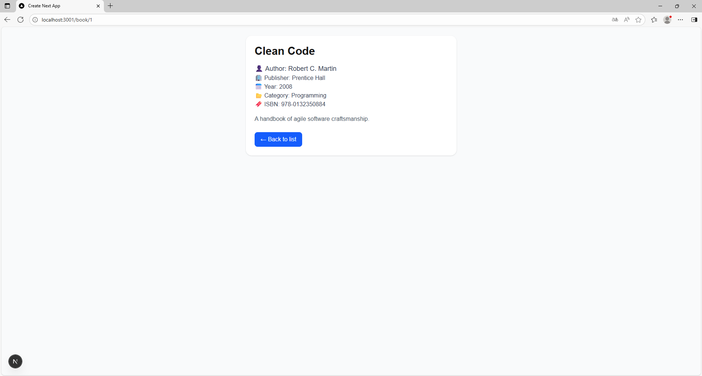
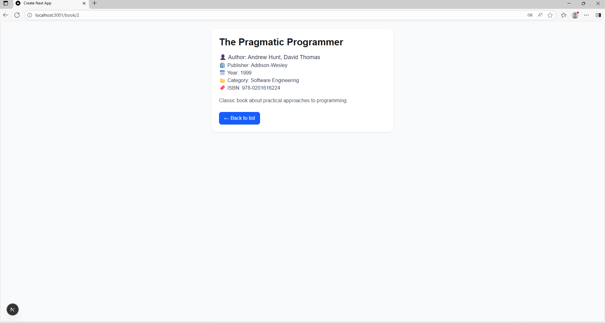

# 📚 Book List Application

แอปพลิเคชันตัวอย่างที่สร้างด้วย **Next.js + Tailwind CSS**  
สำหรับแสดงรายการหนังสือ และสามารถกดเข้าไปดูรายละเอียดของหนังสือแต่ละเล่มได้

---

## 🚀 คุณสมบัติ (Features)

- หน้าแรกแสดง **รายการหนังสือ** (ชื่อ + ผู้แต่ง)  
- สามารถกดปุ่ม **View Details** เพื่อไปยังหน้ารายละเอียด  
- หน้าแสดงรายละเอียด (Detail Page) แสดงข้อมูลหนังสือครบถ้วน เช่น:
  - ชื่อหนังสือ
  - ผู้แต่ง
  - ปีที่พิมพ์
  - รายละเอียด (Description)
- ออกแบบ UI ด้วย Tailwind ให้ใช้งานง่ายและดูสบายตา

---

## 🖼 ตัวอย่างหน้าจอ (Screenshots)

# Book App

## 📸 Screenshot หน้า Home


## 📸 Screenshot หน้า Detail



---

## ⚙️ การติดตั้งและใช้งาน (Installation & Usage)

1. Clone โปรเจกต์นี้  
   ```bash
   git clone https://github.com/Jatupat27/book-list-app.git
   cd book-list-app
   ```

2. ติดตั้ง dependencies  
   ```bash
   npm install
   ```

3. รันเซิร์ฟเวอร์ development  
   ```bash
   npm run dev
   ```

4. เปิดในเบราว์เซอร์  
   ```
   http://localhost:3000
   ```

---

## 📂 โครงสร้างไฟล์หลัก (Main Structure)

```
app/
 ├── page.tsx          # หน้า Home
 ├── book/
 │    └── [id]/
 │         └── page.tsx   # หน้าแสดงรายละเอียดหนังสือ (Dynamic Route)
components/
 └── BookCard.tsx      # UI ของการ์ดหนังสือ
public/
 └── screenshots/      # โฟลเดอร์เก็บรูปแคปหน้าจอ
```

---

## 👨‍🎓 จัดทำโดย
- ชื่อนักศึกษา: จตุภัทร อนุเดชากุล
- รหัสนักศึกษา: 663450035-5
